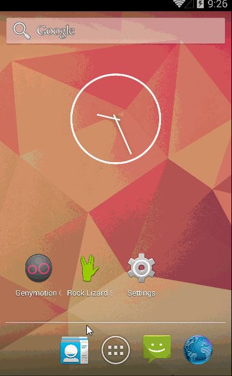

Rock Paper Scissors Lizard Spock
=================

This is an app for Android mobile devices to play rock-paper-scissors-lizard-Spock, an expanded version of the rock-paper-scissors game.  The new game was invented by Sam Kass and Karen Bryla, and popularized by the television show *The Big Bang Theory*.  You can download the latest version of this app from the Google Play store at http://bit.ly/lizardspock.  
  
The five weapons graphics I use throughout the game are derivative works of the originals by Wikimedia user Nojhan and adapted by Wikimedia DMarks, under the Creative Commons license CC-BY-SA. I updated the colors, changed the placement of the weapons, and made many sub-sets of the original graphic. In turn, I license my graphics under the same license, [CC-BY-SA](http://creativecommons.org/licenses/by-sa/4.0/).

**Feature backlog**  
You can see my [issues list](https://github.com/wangela/rock-lizard-spock/issues?direction=asc&sort=created&state=open) to see what features I'll be working on. Send me a note if you'd like to collaborate or suggest another feature!

## Implementation Notes
**Clickable image hotspots**  
One interesting challenge of building this app was to make the graphic of five clickable weapons scale to the many screen sizes found with Android devices. Simply placing the weapon circles as image buttons in a relative layout would subject them to unpredictable scaling behavior, breaking the nice symmetry of the pentagon shape when encountering wider or taller screen proportions.

To account for this, I used an invisible hotspot image underlay with color-coded hotspots (credit to [Bill Lahti for his instructional tutorial](http://blahti.wordpress.com/2012/06/26/images-with-clickable-areas/) of this method). The hotspot image will scale exactly with the visible weapons image, and incurs minimal graphical overhead (the hotspot image is under 2 KB in filesize).

**Supporting multiple screen sizes and densities**  
I followed Android best practices and created 4 versions of each of 35 drawable images (140 exports from Inkscape, plus more for every time I needed to tweak a graphic! I need a script for this, badly.) in order to support all screen sizes and densities. I also had to create a separate version of each of the layout pages (sw600dp, meaning a layout that applies to any device with at least 600dp width) in order for the game to look nice on tablets and above.

**Complex animations**  
Animations were key to making the game feel "fun". Scaling view animations based on screen size turned out to be challenging. Property animations don't support percentage-based scaling out-of-the-box so I had the option to create a custom view with new getters and setters and calculating display dimensions using getSize of the display, but I decided to go with tween-based animation instead. I probably ought to switch back to property animation of a custom view instead; I think they're faster. I had a lot of debugging to do with alphas, which are finicky (if you set the alpha to 0 in your layout XML, it won't be visible during animation even if your animation includes an alpha animation that brings alpha to 1.0).

**Facebook SDK**  
The Facebook SDK documentation leaves much to be desired. I was able to implement login and sharing an update, but when trying to implement OpenGraph stories and AppLinks for deep linking to the app, I hit a lot of dead ends and will need to find documentation outside Facebook.

**Sticky Item in a ScrollView**  
Another UX feature I wanted was for the Rules page. I wanted the five-weapon graphic to stay visible on screen no matter how far down in the rules the user has scrolled. Although there are only 10 rules, they tend to extend off screen for most smartphones, and even if the user was viewing the last rule I wanted him to be able to refer to the diagram.

A nice solution I found was Emil Sjölander's [Sticky ScrollView Items library](https://github.com/emilsjolander/StickyScrollViewItems) which was much more convenient to implement than Roman Nurik's fragment-based ["Sticky"](https://plus.google.com/+RomanNurik/posts/1Sb549FvpJt) which I am including here in case you prefer to try it.

**Custom Launcher App Icon**  
I very much appreciated Roman Nurik's [Android Launcher Icon Generator](http://romannurik.github.io/AndroidAssetStudio/icons-launcher.html) which gave my icon the bevel effect suggested by [Android design guidelines](http://android-developers.blogspot.com/2013/07/making-beautiful-android-app-icons.html). It was much nicer than what I was able to achieve after quite a bit of time mucking around with rudimentary Illustrator skills. I'd love to make or discover a similar tool that takes any vector image and spits out a .zip of the correct resolutions for all app graphics, not just icon-sized graphics.

## Original CodePath course project plan

### Milestone 1:
 * [x] Drawables for start screen, play screen and outcome screen created (5/5)
 * [x] User taps on one of the five icons to choose his weapon (5/5)
 * [x] Device opponent chooses one of the five icons randomly as its weapon
 * [x] User sees his choice vs opponent’s choice and is informed of Win/Lose/Draw outcome along with the applicable rule
 * [x] User can click “again” button to start over
 * [x] User is always displayed as one color, Opponent is always displayed as a different color

### Milestone 2:
 * [x] User chooses single player mode (against device), two player mode, or rules review page
 * [x] User can preview his choice’s relationships with the other icons before locking in his choice with a separate “Fight!" button (5/5)
 * [ ] Two player mode uses Internet or Bluetooth pairing to match opponents (will choose after researching difficulty and reliability of each method)
 * [ ] Two player mode gives option of "Pass & Play" version or "private wifi" version
 * [x] In "Pass & Play" version, P1 chooses weapon as normal, then weapon is hidden and P1 is instructed to pass device to P2 to choose weapon.
 * [x] In "Pass & Play" version, the winner is announced.
 * [ ] In "private wifi" version, after both players have chosen their weapon, each player sees the outcome from their own point of view (one sees "you win!", one sees "you lose!").
 * [x] User can select an icon on the rules review page to highlight relevant relationships when each icon is selected
 * [x] User can click Home icon in action bar to return to start screen
 * [x] User can click Question icon in action bar to view Rules screen
 * [x] When viewing Rules screen, user can click "back" to return to previous screen with saved state if play was in progress

### Stretch:
 * [x] User can click button on Outcome page to share status on Facebook “We just played Rock-Paper-Scissors-Lizard-Spock to decide…” with link to Play store listing
 * [x] User can log in to Facebook account using OAuth
 * [x] User can edit status message before posting to Facebook with desired post visibility
 * [ ] Facebook status update has fun Open Graph stories like "Jane Doe decapitated a lizard in Rock Paper Scissors Lizard Spock"
 * [ ] User hears different sound effects for Win, Lose, and Draw outcomes
 * [ ] User sees a countdown of limited time to lock in his choice or else the current choice gets locked in
 * [ ] User can set preferences (sound on/off, player name, limited time mode)
 * [ ] User can click on embedded YouTube video of Sheldon explaining the rules in Rules Review page (like https://play.google.com/store/apps/details?id=lal.app.rpsls&hl=en)

**Week 2 Milestone walkthrough (does not include animations that make the game "fun"):**  
One-player mode and Rules page view:  

Two-player mode (Pass-and-Play version):  

GIFs created with [LiceCap](http://www.cockos.com/licecap/).
