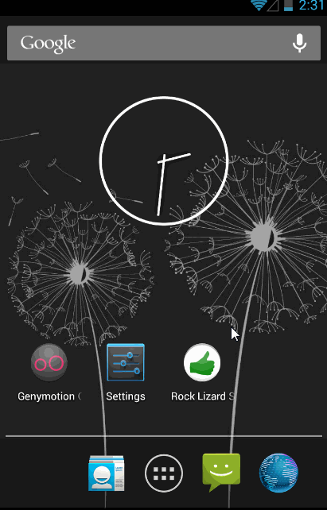

Rock Paper Scissors Lizard Spock
=================

This is an app for Android mobile devices to play rock-paper-scissors-lizard-Spock, an expanded version of the rock-paper-scissors game.  The new game was invented by Sam Kass and Karen Bryla, and popularized by the television show *The Big Bang Theory*.  

## Milestone 1:
 * [x] Drawables for start screen, play screen and outcome screen created (1/5)
 * [x] User taps on one of the five icons to choose his champion (1/5)
 * [x] Device opponent chooses one of the five icons randomly as its champion
 * [x] User sees his choice vs opponent’s choice and is informed of Win/Lose/Draw outcome along with the applicable rule
 * [x] User can click “again” button to start over
 * [x] User is always displayed as one color, Opponent is always displayed as a different color

## Milestone 2:
 * [ ] User chooses single player mode (against device), two player mode, or rules review page
 * [x] User can preview his choice’s relationships with the other icons before locking in his choice with a separate “Fight!" button (1/5)
 * [ ] Two player mode uses Internet or Bluetooth pairing to match opponents (will choose after researching difficulty and reliability of each method)
 * [ ] User can select an icon on the rules review page to highlight relevant relationships when each icon is selected
 * [ ] User can click Home icon in action bar to return to start screen
 * [ ] User can click Question icon in action bar to view Rules screen
 * [ ] When viewing Rules screen, user can click "back" to return to previous screen with saved state if play was in progress

## Stretch:
 * [ ] User can click button on Outcome page to share status on Facebook “We just played Rock-Paper-Scissors-Lizard-Spock to decide…” with link to game webpage
 * [ ] User can log in to Facebook account using OAuth
 * [ ] User can edit status message before posting to Facebook with default post visibility
 * [ ] User hears different sound effects for Win, Lose, and Draw outcomes
 * [ ] User sees a countdown of limited time to lock in his choice or else the current choice gets locked in
 * [ ] User can set preferences (sound on/off, player name, limited time mode)
 * [ ] User can click on embedded YouTube video of Sheldon explaining the rules in Rules Review page (like https://play.google.com/store/apps/details?id=lal.app.rpsls&hl=en)

**Week 1 Milestone walkthrough:**  
Implemented all basic features in a single case (user choosing Spock only) to test code logic. Graphics and logic will multiply by 5 to handle other user choices.  

GIF created with [LiceCap](http://www.cockos.com/licecap/).

## Implementation Notes
One interesting challenge of building this app was to make the graphic of five clickable weapons scale to the many screen sizes found with Android devices. Simply placing the weapon circles as image buttons in a relative layout would subject them to unpredictable scaling behavior, breaking the nice symmetry of the pentagon shape when encountering wider or taller screen proportions.

To account for this, I used an invisible hotspot image underlay with color-coded hotspots (credit to [Bill Lahti for his instructional tutorial](http://blahti.wordpress.com/2012/06/26/images-with-clickable-areas/) of this method). The hotspot image will scale exactly with the visible weapons image, and incurs minimal graphical overhead (the hotspot image is under 2 KB in filesize).
